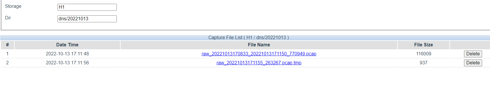

# Packet 2 pcap

## Save DNS packet to pcap

```xml
<run>
    <filter id="1" sessionBase="no">
        <or>
            <find name="udp.port" relation="==" content="53"/>
        </or>
    </filter>
    <output id="1">
        <port>H1</port>
        <dir category="day">dns</dir>
    </output>
    <chain>
        <in>P6</in>
        <fid>F1</fid>
        <out>O1</out>
    </chain>
</run>
```

<figure><figcaption></figcaption></figure>
