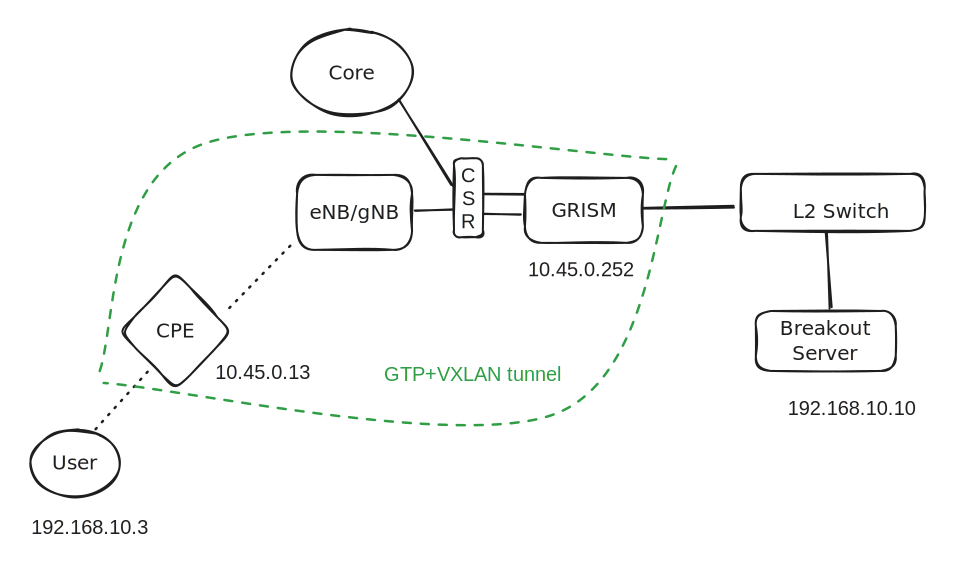

# MEC+VXLAN Breakout





## Config XML

```xml
<configSet reboot="no">
    <args>
        <s1cCorrelation>True</s1cCorrelation>
        <flowExtensionGtpTunnelhdr>True</flowExtensionGtpTunnelhdr>
        <vxlanCorrelation>True</vxlanCorrelation>
        <vxlanCorrelationPort>P8</vxlanCorrelationPort>   
    </args>
    <filters>
        <in-tunnels>
            <GTP>True</GTP>     
            <VXLAN>True</VXLAN>
        </in-tunnels>
    </filters>
</configSet>
```

## GRISM XML

```xml
<run>
    <filter id="1" sessionBase="no">
        <or>
            <find name="ip.src" relation="==" content="10.45.0.0/16"/>
        </or>
    </filter>
    <filter id="3" sessionBase="no">
        <or>
        </or>
    </filter>
    <filter id="4" sessionBase="no">
        <or>
            <find name="ip.dst" relation="==" content="10.45.0.252"/>
        </or>
    </filter>
    <filter id="5" sessionBase="no">
        <or>
            <find name="icmp.type" relation="==" content="8"/>
        </or>
    </filter>
    <filter id="6" sessionBase="no">
        <or>
            <find name="vxlan" relation="==" content=""/>
        </or>
    </filter>
    <output id="1" arp_dstip_mac="no">
        <port>P8</port>
        <stripping>gtp</stripping>
    </output>
    <output id="2">
        <port>P6</port>
        <tagging>gtp2</tagging>
    </output>
    <output id="3">
        <port>P5</port>
        <arp_reply_default_mac/>
    </output>
    <output id="4">
        <port>P9</port>
        <icmp_reply/>
    </output>
    <output id="5">
        <port>P9</port>
        <tagging>vxlan</tagging>
    </output>
    <output id="6">
        <port>P5</port>
        <stripping>vxlan</stripping>
    </output>
    <chain>
        <in>P7</in>
        <out>P6</out>
    </chain>
    <chain>
        <in>P6</in>
        <fid type="and">F1,F3</fid>
        <out>O1</out>
        <next type="notmatch">
            <out>P7</out>
        </next>
    </chain>
    <chain>
        <in>P5</in>
        <out>O5</out>
    </chain>
    <chain>
        <in>P8</in>
        <fid>F6</fid>
        <out>O6</out>
        <next type="notmatch">
            <fid type="and">F4,F5</fid>
            <out>O4</out>
        </next>
    </chain>
    <chain>
        <in>P9</in>
        <out>O2</out>
    </chain>
</run>
```
