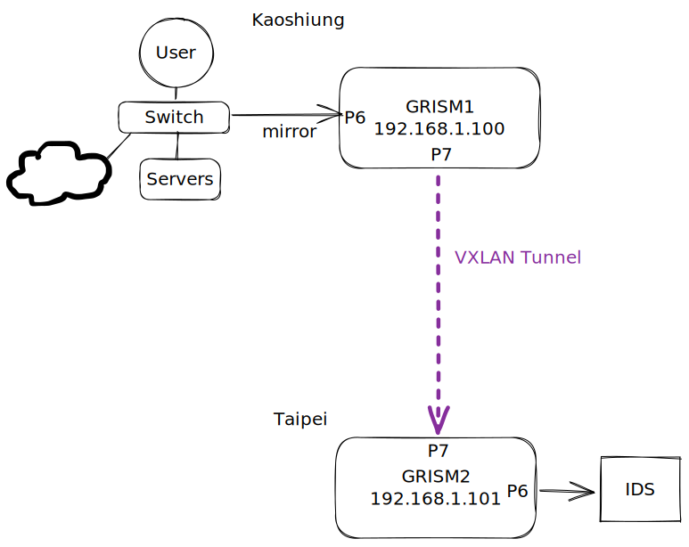

# VXLAN Encapsulation

## Mirror



### GRISM1

#### Config XML

```xml
<configSet reboot="no">
    <filters>
        <in-tunnels>     
            <VXLAN>True</VXLAN>
        </in-tunnels>
    </filters>
     <ifcfgs>
        <find role="ft">
            <enable>True</enable>
            <ip>192.168.1.100</ip>
            <name>P7</name>
            <netmask>255.255.255.0</netmask>
            <gateway></gateway>
        </find>
    </ifcfgs>
</configSet>
```

#### GRISM XML

```xml
<run>
    <output id="7">
        <port>P7</port>
        <vxlan_dip>192.168.1.101</vxlan_dip>
        <vxlan_sport>4789</vxlan_sport>
        <vxlan_dport>4789</vxlan_dport>
        <vxlan_vni>1234</vxlan_vni>
    </output>
    <chain>
        <in>P6</in>
        <out>O7</out>
    </chain>
</run>
```

### GRISM2

#### Config XML

```xml
<configSet reboot="no">
    <filters>
        <in-tunnels>     
            <VXLAN>True</VXLAN>
        </in-tunnels>
    </filters>
     <ifcfgs>
        <find role="ft">
            <enable>True</enable>
            <ip>192.168.1.101</ip>
            <name>P7</name>
            <netmask>255.255.255.0</netmask>
            <gateway></gateway>
        </find>
    </ifcfgs>
</configSet>
```

#### GRISM XML

```xml
<run>
    <chain>
        <in>P7</in>
        <out>P6</out>
    </chain>
</run>
```

## Inline


### Config XML

```xml
<configSet reboot="no">
    <filters>
        <in-tunnels>     
            <VXLAN>True</VXLAN>
        </in-tunnels>
    </filters>
</configSet>
```

### GRISM XML

```xml
<run>
    <filter id="2" sessionBase="no">
        <or>
            <find name="arp.request.target.ip" relation="==" content="192.168.1.155"/>
        </or>
    </filter>
    <filter id="3" sessionBase="no">
        <or>
            <find name="vxlan.vni" relation="==" content="1234"/>
        </or>
    </filter>
    <output id="1" arp_dstip_mac="yes">
        <port>P7</port>
        <vxlan_sip>192.168.1.155</vxlan_sip>
        <vxlan_dip>192.168.1.12</vxlan_dip>
        <vxlan_sport>4789</vxlan_sport>
        <vxlan_dport>4789</vxlan_dport>
        <vxlan_vni>1234</vxlan_vni>
    </output>
    <output id="2">
        <port>P6</port>
        <stripping>vxlan</stripping>
    </output>
    <output id="3">
        <port>P7</port>
        <arp_reply_default_mac/>
    </output>
    <chain>
        <in>P6</in>
        <out>O1</out>
    </chain>
    <chain>
        <in>P7</in>
        <fid>F2</fid>
        <out>O2</out>
        <next type="notmatch">
            <fid>F3</fid>
            <out>O2</out>
        </next>
    </chain>
</run>
```
